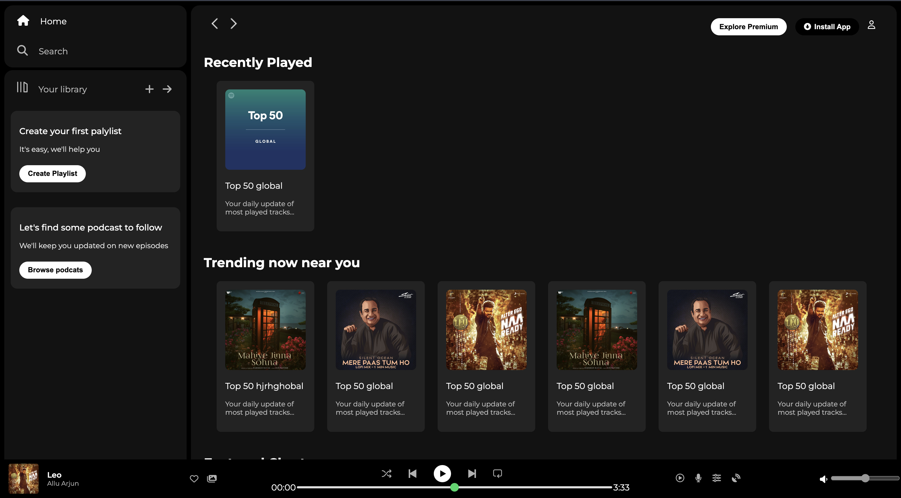

# 🎵 Spotify Clone (HTML + CSS)

A simple **Spotify Web Player Clone** built using only **HTML & CSS**.
This was my **first project** after learning the basics of frontend development.

---

### Homepage

*(Add your own screenshot inside the assets folder and update the path)*

---

## 🚀 Features

- 🎨 **Clean UI** inspired by Spotify
- 📂 Sidebar with navigation (Home, Search, Library)
- 🎵 Music player layout (album, playback, controls)
- 📱 Responsive design for smaller screens (using media queries)

---

## 🛠️ Tech Stack

- **HTML5**
- **CSS3**
- **Font Awesome** (icons)
- **Google Fonts** (Montserrat)

---

## 📂 Folder Structure

SpotifyClone/
├── index.html       <-- moved from Spotify/code/
├── style.css        <-- moved from Spotify/code/
├── assets/          <-- moved from Spotify/assets/
│   ├── images/
│   └── logos/
└── README.md

---

## ⚡ Live Demo

👉 [View on GitHub Pages]()

---

## 🤝 Contributing

This is a beginner project, but feel free to fork and improve it! 💡

---

## 📜 License

This project is licensed under the MIT License.
